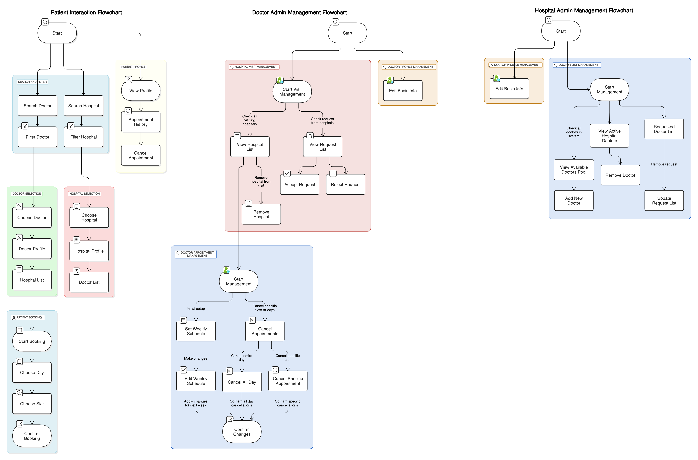

# first-commit

## Table of contents
- [Team Members](#Team-Members)
- [Mentor](#mentor)
- [Project Description](#project-description)
    - [Features](#features)
    - [Flow Diagram](#flow-diagram)
    - [Page Documentations](#page-documentation)

## Team Members
- Tanzimbn (Team Leader)
- AnindaRoyDhruba
- shawal061

## Mentor
- anik587

## Project Description
DocNest is a user-friendly platform designed to connect patients with doctors and hospitals seamlessly.
### Features
#### 1. **Search for Doctors**
   - Search by **specialization** (e.g., cardiologist, dermatologist, etc.)
   - Filter by **city** and **gender** of the doctor

#### 2. **Find Hospitals**
   - **Location-based search** to find hospitals near you

#### 3. **Doctor Profiles**
   - View detailed profiles including **hospital affiliation** and **seating times**
   - **Book appointments** directly with doctors

#### 4. **Hospital Profiles**
   - Hospitals can **manage their details** and **update profiles**

#### 5. **Doctor-Hospital Interaction**
   - **Hospitals can invite doctors** to join their facility and set seating times
   - **Doctors can accept invitations** and manage their schedules

#### 6. **Appointment Booking**
   - **Book appointments** with doctors based on their availability

#### 7. **User Profiles (Patients)**
   - Patients can create and manage their **profile**
   - View **appointment history**

#### 8. **Admin Features**
   - **Doctor Admin**: Manage doctor profiles and schedules
   - **Hospital Admin**: Invite doctors, manage schedules, and hospital details

### Flow Diagram

### Page Documentation
[pages.md](doc/pages.md)

## Getting Started
1. Clone the repository
2. Install dependencies
3. Start development

## Development Guidelines
1. Create feature branches
2. Make small, focused commits
3. Write descriptive commit messages
4. Create pull requests for review

## Resources
- [Project Documentation](docs/)
- [Development Setup](docs/setup.md)
- [Contributing Guidelines](CONTRIBUTING.md)
